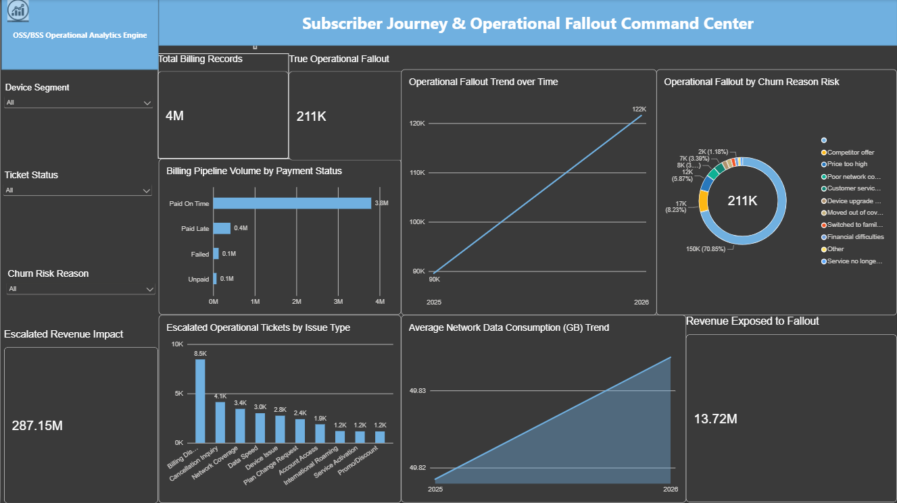

# Cross-Functional Telecom Order Management & Churn Fallout Analytics

A cross-functional Power BI & SQL dashboard tracking order billing fallout, technical tickets, and network usage metrics.

## 📊 Interactive Dashboard Preview

## 📁 Project Components
* **SQL Pipeline Script:** [telecom_analytics_pipeline.sql](telecom_analytics_pipeline.sql) contains the complete data cleaning and aggregation script.
* **Power BI Workbook:** Due to GitHub's file size limitations, you can download the full interactive `.pbix` workbook here: **[Download Power BI Workbook](https://drive.google.com/file/d/1h5MaT4Hal0ML4FYgtfFDrf0sOHb5dSZU/view?usp=sharing)**

## 🔍 Project Overview
This enterprise-level Data Analytics project leverages a **500K subscriber dataset** across a **5-table star schema** to bridge the gap between financial billing pipelines, network activity logs, and technical customer support ticketing systems. 

Instead of tracking standard sales performance, this dashboard isolates root causes behind transactional failures, quantifies total revenue leakage risk, and exposes the exact operational triggers that lead to subscriber churn.

## 🛠️ Tech Stack
* **Business Intelligence:** Power BI Desktop, DAX, Power Query
* **Database & Querying:** Oracle SQL / MySQL (Complex Joins, Window Functions, Aggregate Calculations)
* **Data Prep:** Microsoft Excel (Data Profiling & Mappings)

## 📐 Data Architecture (Star Schema Model)
The analytics environment is built upon 5 highly interconnected tables:
* `Dim_Subscriber`: Core subscriber demographics, plan types, and contract types.
* `Dim_Churn_Analysis`: Customer retention logs and machine-learned churn probability indicators.
* `Fact_Billing_Ledger`: Multi-million record transactional history tracking payment statuses and revenue.
* `Fact_Network_Usage`: Granular network usage details including data consumption volume (GB).
* `Fact_Operations_Tickets`: Backend support ticket details tracking operational defects and workflow escalations.

## 💡 Business Questions Answered & Insights Delivered
* **Revenue Exposure:** Identified **211K distinct accounts** caught in critical billing fallout, exposing **\$13.72M in revenue** to loss risk.
* **Root-Cause Isolation:** Proved that **Billing Disputes** and **Network Connection Delays** make up the majority of escalated operational issues.
* **Retention Linkage:** Established a direct correlation showing that **70.85% of billing pipeline failures** resulted in subscribers jumping to competitor offers.

## 🎨 Core Visualizations Included
1. **Executive Summary Cards:** Instant visibility into Total Billing Records, True Fallout Volume, and Exposed Revenue.
2. **Billing Status Segmentations:** Dynamic distribution patterns across all transactional groups.
3. **Operational Escalation Columns:** Granular bar chart tracking active support blockages by issue type.
4. **Time-Series Trend Line:** Dynamic analysis tracking whether process defects are improving month-over-month.
5. **Churn Risk Matrix:** Proportional donut distribution highlighting why failing accounts migrate away.
